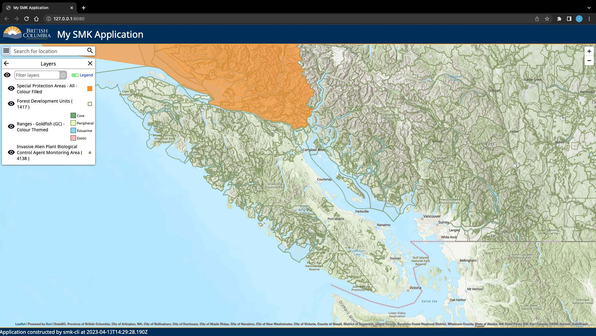

### This embedded map is based on the Simple Map Kit - a versatile and lightweight toolkit for building a simple web map.  
&nbsp;  

It has two main layers: *DataBC Layers: Special Protection Areas - All - Colour Filled* and *WMS layers: Forest Development Units ( 1417 )*, as well as two bonus layers: *DataBC Layers: Ranges - Goldfish (GC) - Colour Themed*, and *Invasive Alien Plant Biological Control Agent Monitoring Area ( 4138 )*

&nbsp;

### In order to start the application, there are several preparations:  
1. Please clone the repo to your local. After cloning the repo, use `cd` command to navigate to the cloned folder.  
2. Make sure you have Node installed on your machine. If not, please go to [Downloading and installing Node.js and npm](https://docs.npmjs.com/downloading-and-installing-node-js-and-npm) to follow steps to install.  
3. Install from NPM for SMK. The current repo doesn’t include the node_modules. The command that you should use: `npm install @bcgov/smk`.  
4. (Optional) Install smk-cli (configure the SMK app). You can follow the section of Installing smk-cli on the page: [Installing SMK](https://bcgov.github.io/smk/docs/installation) Also, please make sure to test whether the smk is working. After you finish this step, please navigate to [Editing your SMK application
](https://bcgov.github.io/smk-cli/edit-an-app.html) for the detailed configurations: adding/removing layers, add new tools, change basemap style(Imagery, Stamen Toner Light, Streets, etc.). When you finish configuration, please press *ctrl + c* on your keyboard to terminate the smk edit.  
***Please note, you should be able to skip this step if you don’t need to configure the app. And make sure to restart the app when you update the configurations.***  

Above steps are the prerequisite that you need to complete in order to get the app ready.  
### The usage of the SMK app:  
1. Start the app. Command to start app: `npm run view`. You should run this command in the cloned root folder.  
2. Your browser(default) will open the startup window of the SMK app, and you will see a map view with a search bar and several icons on the top left corner.  
3. Click the burger menu icon(first icon) to see a dropdown list to show the following items:  
    * About My SMK Application  
    * Layers  
    * Geomark
4. Choose the second item: Layers to see the embedded map. And then, you will see three layers:
   * Special Protection Areas - All - Colour Filled
   * Forest Development Units (1417)
   * Ranges - Goldfish(GC) - Colour Themed
   * Invasive Alien Plant Biological Control Agent Monitoring Area ( 4138 )  
Meanwhile, there is a filter search bar for you to enter keywords to filter those three layers. And if you want to check any *Legend*, please toggle the *Legend*. Please note, all these layers are automatically embedded, and you don’t need to select. If you click any of the layers, it will navigate you to *Data Catelogue* page to show the information of the dataset.  
1. The current solution supports showing embedded maps based on location search. You can enter any city in the BC province to see the detailed embedded map. And you can use the zoom function that sits on the top right corner to zoom in/out the map. Also, you can drag the map to check any city.  
2. Quit the SMK app. Press *ctrl + c* on your keyboard to terminate the app.  
&nbsp;  

The Final embedded map is showing below:  

